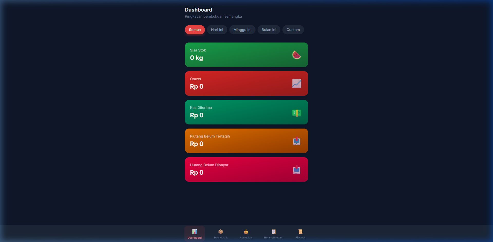
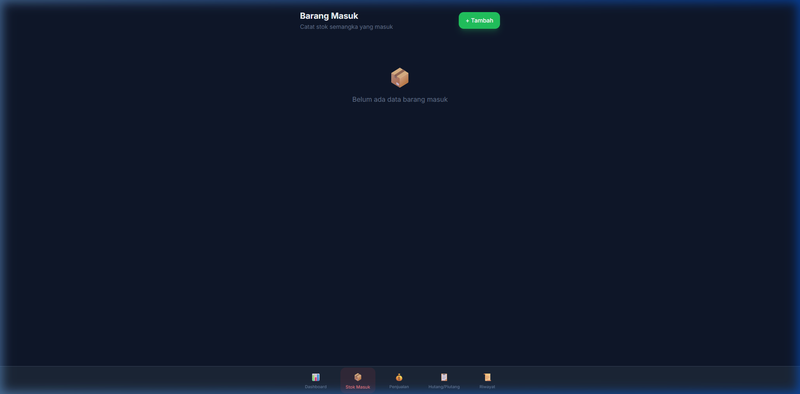
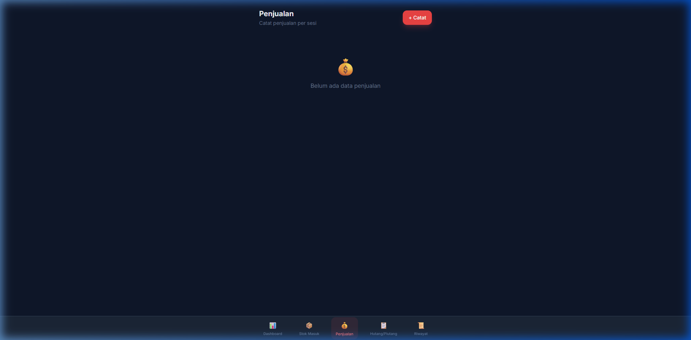
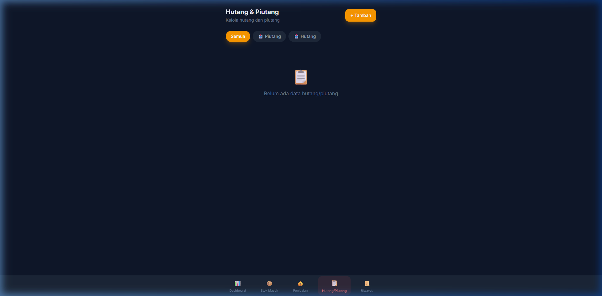

# 🍉 Pembukuan Semangka (v1.0.0)

Aplikasi web pembukuan operasional bisnis penjualan semangka tingkat grosir/pasar. Dirancang dengan pendekatan *mobile-first* (nyaman dibuka di HP) untuk mempermudah pemilik usaha mengelola stok, penjualan, serta pencatatan hutang/piutang secara *real-time* dan akurat.



## ✨ Fitur Unggulan

Aplikasi ini telah mencapai versi stabil pertama dengan fitur lengkap:

- 📊 **Dashboard Analitik & Visualisasi**
  Pantau sisa stok (kg), omzet, modal, keuntungan bersih, kas diterima, serta hutang/piutang secara *real-time*. Dilengkapi grafik riwayat penjualan interaktif.
- 📦 **Manajemen Barang Masuk (Restock)**
  Catat penerimaan barang beserta harga modal. Dilengkapi fitur **unggah foto nota/barang** (otomatis di-compress maksimal 500KB) dan sistem pembayaran bertahap (cicilan/sisa tagihan) kepada pengirim dengan logika FIFO (*First In First Out*).
  <br>
  
- 💰 **Pencatatan Penjualan Harian**
  Catat rekap penjualan harian dengan pembagian shift/sesi (Siang/Malam), lengkap dengan total Kg terjual dan uang masuk.
  <br>
  
- 📋 **Buku Hutang & Piutang**
  Lacak dengan mudah siapa yang belum bayar (piutang) dan tagihan yang belum dilunasi (hutang), lengkap dengan riwayat cicilan pembayarannya. Total hutang barang masuk otomatis sinkron ke halaman ini.
  <br>
  


- 🗑️ **Sistem Keamanan Data (Soft Delete)**
  Data yang dihapus tidak langsung hilang! Semua transaksi yang "dihapus" akan masuk ke menu "Riwayat" (Mode Keranjang Sampah) dan **bisa dipulihkan (restore)** kembali kapan saja.
- 🔎 **Filter Pintar**
  Semua halaman dilengkapi filter periode otomatis (Bulan Ini, Minggu Ini, Hari Ini, Semua) untuk mempermudah rekap pembukuan harian maupun bulanan.

## 🛠️ Tech Stack & Infrastruktur

- **Frontend**: React.js, Vite, Tailwind CSS v4
- **Backend**: Node.js, Express.js
- **Database**: PostgreSQL
- **Deployment**: Netlify (Frontend) & Railway (Backend + DB)

## 🚀 CI/CD & Automasi (Deployment)

Proyek ini menggunakan **GitHub Actions** untuk *Continuous Integration/Continuous Deployment* (CI/CD). Setiap *push* ke *branch* `main` akan memicu:
1. Pengecekan otomatis dan *build* proyek.
2. *Auto-deploy* backend ke **Railway**.
3. *Auto-deploy* frontend ke **Netlify**.

## 💻 Cara Install & Menjalankan Lokal

Jika Anda ingin menjalankan atau mengembangkan aplikasi ini secara lokal di PC Anda:

### 1. Database (PostgreSQL)
Buat database PostgreSQL kosong, lalu jalankan migrasi tabel:
```bash
cd backend
cp .env.example .env
# Edit .env, ganti DATABASE_URL sesuai koneksi database lokal Anda
npm install
npm run migrate
```

### 2. Backend (API Server)
```bash
cd backend
npm run dev
# Server akan berjalan di http://localhost:5000
```

### 3. Frontend (Web App)
Buka tab terminal baru:
```bash
cd frontend
npm install
npm run dev
# Aplikasi web akan berjalan di http://localhost:5173
```

## ⚙️ Environment Variables

Aplikasi ini membutuhkan file `.env` untuk berjalan.

### Backend (`backend/.env`)
| Variable | Keterangan |
|---|---|
| `DATABASE_URL` | PostgreSQL connection string (Wajib) |
| `PORT` | Port server backend (Default: 5000) |
| `FRONTEND_URL` | URL frontend untuk mengatur CORS (Keamanan akses) |

### Frontend (`frontend/.env`)
| Variable | Keterangan |
|---|---|
| `VITE_API_URL` | URL dari backend API (contoh saat live: `https://app-backend.railway.app/api`) |

---
*Dibuat untuk mempermudah operasional pasar. 🍉*
